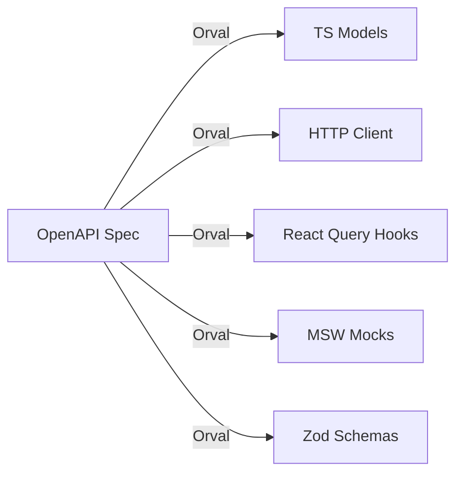

# 01 · What Is Orval

Orval is a **code generator**: feed it an OpenAPI specification and it emits a type-safe TypeScript client tailored to your stack. The pitch is "stop writing boilerplate" — the request functions, response types, query keys, and even mocks all fall out of the API contract instead of being hand-maintained.

## What it generates

From a single spec, depending on configuration, Orval produces:

- **TypeScript models** — an interface/type for every schema (`Order`, `OrderListResponse`, request bodies, params…).
- **A typed client** — one function per operation, using your chosen HTTP library (Axios or Fetch).
- **Data-fetching hooks** — for `client: 'react-query'` (and `vue-query`, `svelte-query`, `solid-query`, `swr`, `angular`): a `useX` hook per operation **plus a query-key generator** per query.
- **MSW mock handlers** — Mock Service Worker handlers populated with Faker.js data, so the UI runs with no backend.
- **Zod schemas** — runtime validators derived from the same spec.



For a `GET /pets/{petId}` operation, the React Query output is roughly:

```
showPetById()              // the raw typed request function
getShowPetByIdQueryKey()   // the query-key generator
useShowPetById()           // the React Query hook (wraps useQuery)
```

The hook even wires `enabled` automatically from required path params, and accepts pass-through `query`/HTTP options.

## Why generate instead of hand-write

| Hand-written client | Orval-generated |
| --- | --- |
| Types drift from the real API | Types **are** the API contract |
| Query keys invented per call site, drift, break invalidation | Consistent, generated key per operation |
| Adding an endpoint = manual fetcher + types + hook | Add it to the spec, regenerate |
| Breaking API change discovered at runtime | Discovered at **compile time** the moment you regenerate |
| Mocks maintained separately | Mocks generated from the same source |

The deeper win is **a single source of truth**. The OpenAPI document is the contract between backend and frontend; everything else is derived. A field rename on the server becomes a TypeScript error in the client on the next generate — not a 2am production bug.

## Supported targets (v8)

- **HTTP clients:** Axios, Fetch (`httpClient: 'axios' | 'fetch'`).
- **Query libraries:** React Query / TanStack Query, Vue Query, Svelte Query, Solid Query, SWR, Angular.
- **Other clients:** `axios`, `axios-functions`, `fetch`, `zod`, `hono`, `mcp`.
- **Mocks:** MSW + Faker.
- **Validation:** Zod.

## When Orval is the right call

**Reach for it when:**

- You have (or can produce) a reliable OpenAPI spec.
- The API has more than a handful of endpoints, or changes often.
- You want frontend and backend types to stay provably in sync.
- You're already using React Query and want the keys/hooks for free.

**Think twice when:**

- There's no OpenAPI document and the backend can't emit one (NocoBase-style action endpoints, GraphQL, bespoke RPC). You'd be generating a spec by hand, which defeats the purpose. See [06-workflow-ci.md](./06-workflow-ci.md).
- The API is tiny and stable — three endpoints don't justify a codegen pipeline.
- The spec is low quality (missing `operationId`s, untyped `any` bodies). Garbage in, garbage out: Orval's output is only as good as the spec.

## How it fits this wiki

Orval gives you the **plumbing** (typed requests, hooks, keys). The [TanStack Query deep dive](../tanstack-react-query/README.md) is still where you learn the **policy** that Orval can't decide for you:

- `staleTime`/`gcTime` tuning per data type ([caching lifecycle](../tanstack-react-query/03-caching-lifecycle.md)),
- invalidation strategy after mutations ([invalidation](../tanstack-react-query/06-invalidation.md)),
- optimistic updates ([mutations](../tanstack-react-query/05-mutations-optimistic.md)),
- render isolation with `select` and tracked props ([performance](../tanstack-react-query/10-performance.md)).

Generated hooks accept the same options as the hooks you'd write by hand, so all of that knowledge applies directly.

Continue to [02-setup-config.md](./02-setup-config.md).
