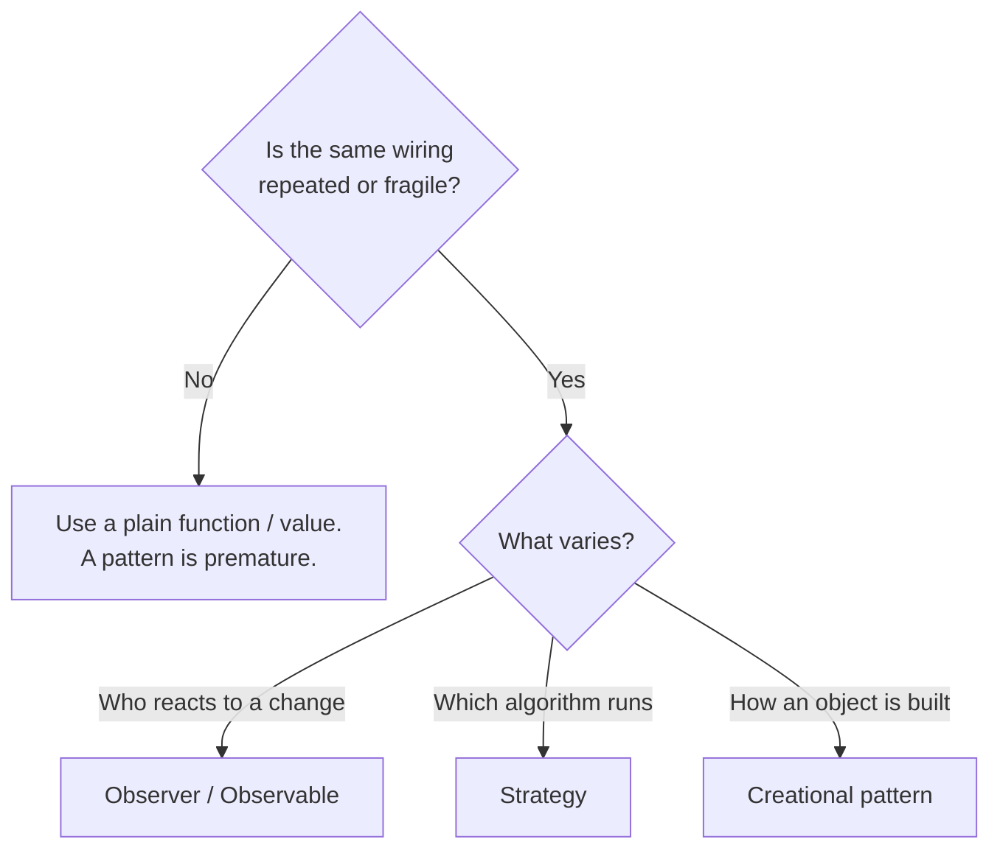

# 01 · Software Design Patterns

## What a pattern actually is

A **design pattern** is a named, reusable solution to a problem that keeps showing up. It is *not* a library, a framework, or a snippet you paste. It's a **shape** — a way of arranging objects and responsibilities — that a community has found worth naming because it recurs.

The value is mostly **vocabulary and structure**:

- **Vocabulary** — "let's use an Observer here" communicates an entire design in two words to anyone who knows the pattern.
- **Structure** — patterns capture the *forces* (what varies, what must stay decoupled) so you don't rediscover the trade-offs each time.

> A pattern is a tool, not a goal. Reaching for one when a plain function would do is how codebases get astronaut architecture.

## The three classic categories

The original "Gang of Four" patterns split into three families by **what they organize**:

| Category | Organizes… | Examples |
| --- | --- | --- |
| **Creational** | How objects are *made* | Factory, Builder, Singleton |
| **Structural** | How objects are *composed* | Adapter, Decorator, Proxy, Facade |
| **Behavioral** | How objects *talk and share responsibility* | **Observer**, Strategy, Command, State |

The **Observer pattern** — the focus of this folder — is *behavioral*: it's about how objects communicate change without being hard-wired to each other.

## Why a pattern earns its keep

A pattern is justified when it removes a real, present cost:

1. **Decoupling** — two parts of the system need to cooperate without knowing about each other directly.
2. **Variation** — something is expected to change (the algorithm, the data source, the number of listeners) and you want to isolate that change.
3. **Repetition** — you've hand-written the same wiring three times and the bugs are in the wiring, not the logic.

If none of those apply, the pattern is overhead. The honest test: *"What duplicated or fragile thing does this delete?"* If the answer is "nothing yet," wait.

## The pattern we care about here

The rest of this folder zooms in on one behavioral pattern — **Observer / Observable** — because it is the hidden engine behind *every* React state-management tool. Understanding it once explains `useState`, Zustand, Redux, React Query, RxJS, and the browser's own event system all at the same time.

Continue to [02-observer-observable.md](./02-observer-observable.md).
