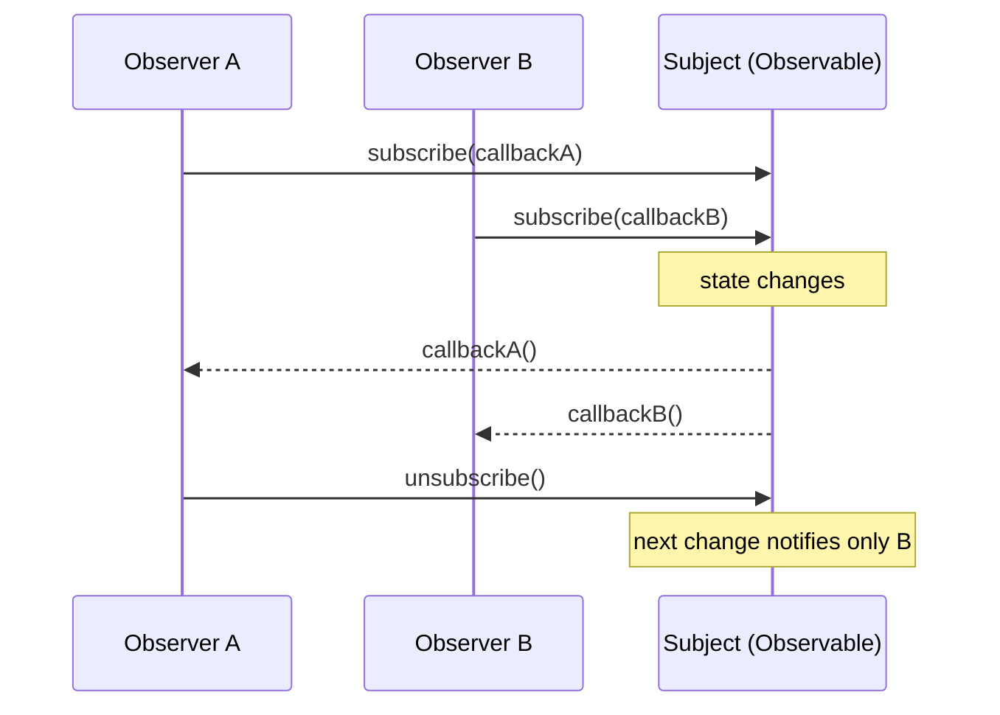

# 02 · The Observer / Observable Pattern

## The problem it solves

Some object holds state. Other objects need to **react** when that state changes. The naive solution is to have the state-holder call each interested object directly:

```ts
// ❌ tightly coupled: the cart must know about every consumer
function addItem(item) {
  items.push(item);
  header.updateBadge(items.length);
  sidebar.renderList(items);
  analytics.track("add_to_cart");
}
```

Every new consumer means editing `addItem`. The cart knows about the header, the sidebar, analytics — it's coupled to all of them. That's the problem.

## The pattern

Invert it. The state-holder keeps a **list of subscribers** and a way to add/remove them. When it changes, it just **notifies the list** — it never names a single consumer.

Two roles:

| Role | Also called | Responsibility |
| --- | --- | --- |
| **Subject** | Observable, Publisher | Holds state; maintains a subscriber list; notifies on change |
| **Observer** | Subscriber, Listener | Registers interest; gets called when the subject changes |



The subject knows *that* there are observers, not *who* they are. Add a tenth consumer? It subscribes. The subject never changes.

## A from-scratch implementation

The whole pattern is about 20 lines. This is the heart of every store you'll meet later:

```ts
type Listener = () => void;

function createObservable<T>(initial: T) {
  let state = initial;
  const listeners = new Set<Listener>();

  return {
    // Observer registers. Returns an unsubscribe function.
    subscribe(listener: Listener): () => void {
      listeners.add(listener);
      return () => listeners.delete(listener);
    },

    // Pull: read the current value.
    getSnapshot(): T {
      return state;
    },

    // Mutate + notify everyone.
    setState(next: T) {
      state = next;
      listeners.forEach((l) => l());
    },
  };
}
```

Usage:

```ts
const counter = createObservable(0);

const unsubscribe = counter.subscribe(() => {
  console.log("changed to", counter.getSnapshot());
});

counter.setState(1); // logs "changed to 1"
counter.setState(2); // logs "changed to 2"
unsubscribe();
counter.setState(3); // logs nothing — observer is gone
```

Three primitives — `subscribe`, `getSnapshot`, `setState` — and you have the entire pattern. Memorize this trio; it reappears verbatim in [file 03](./03-react-state-as-observable.md) as the contract React expects.

## Push vs pull

A subtle but important design choice in the notification:

- **Push** — the subject hands the new value *to* the observer: `listener(newValue)`. Convenient, but the subject decides what each observer gets.
- **Pull** — the subject just says "something changed" with a bare `listener()`, and each observer **reads what it needs** via `getSnapshot()`. More flexible: each observer can read a different slice.

React uses the **pull** model (notify, then re-read), which is exactly why the implementation above splits `getSnapshot()` from the bare-callback notification. We lean into that in [file 04](./04-build-an-observable-store.md).

## The catch: you must unsubscribe

The one footgun. An observer that subscribes but never unsubscribes is a **memory leak** — the subject holds a reference to it forever, and the callback keeps firing for a component that's gone.

```ts
const unsubscribe = store.subscribe(onChange);
// ...later, when the observer is destroyed:
unsubscribe(); // ← non-negotiable
```

In React, this is exactly why `useEffect` subscriptions return their cleanup, and why `useSyncExternalStore` takes a `subscribe` function that *returns an unsubscribe*. The framework automates the discipline the pattern demands.

## Where you've already seen it

- **DOM events** — `addEventListener` (subscribe) / `removeEventListener` (unsubscribe). The element is the subject.
- **RxJS** — `Observable.subscribe()` is this pattern with operators bolted on for streams over time.
- **Node `EventEmitter`** — `.on()` / `.emit()` / `.off()`.
- **Every React state library** — covered next.

Continue to [03-react-state-as-observable.md](./03-react-state-as-observable.md).
