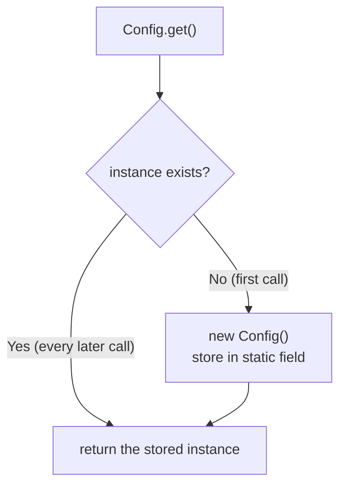
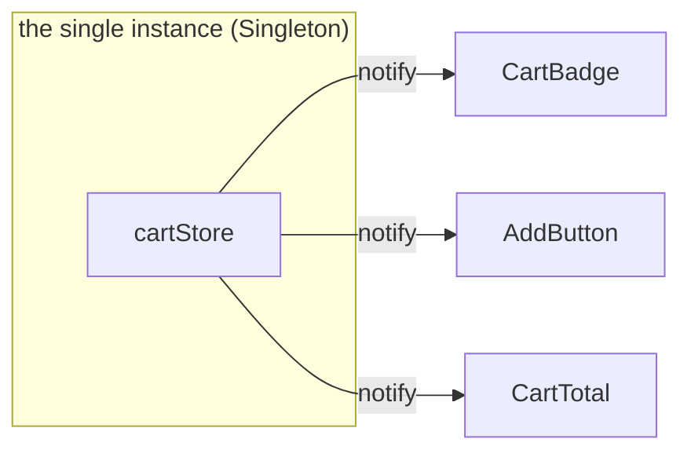

# 06 · Singleton — one instance, shared everywhere

The store in [file 04](./04-build-an-observable-store.md) is exported like this:

```ts
export const cartStore = createStore({ items: 0, lastAction: "—" });
```

Every component that imports `cartStore` gets **the same object** — there is exactly one cart in the whole app, and `CartBadge` and `AddButton` talk to it without sharing a parent. That "exactly one, shared everywhere" guarantee is the **Singleton pattern**. It's the *creational* counterpart to the Observer pattern: Observer says *how* the subject notifies; Singleton says *why there's only one subject to notify*.

## What a Singleton actually is

A **Singleton** is a creational pattern (see the table in [file 01](./01-software-patterns.md)) that ensures a type has **one instance** and gives the rest of the program a **single, global access point** to it.

It earns its keep when an object represents something there is genuinely only *one* of:

- a configuration loaded once at startup,
- a connection pool or HTTP client,
- a cache,
- **a piece of shared application state** — the cart, the current user, the theme.

If two copies of that thing could exist, you'd get split-brain bugs: one component adds to "the" cart and another reads from a *different* cart that never heard about it.

> The honest test from [file 01](./01-software-patterns.md) applies: a Singleton is justified only when a second instance would be a *bug*, not just unnecessary. If two instances are merely wasteful, you want caching or DI — not a hard "only one allowed" guarantee.

## The classic implementation

The textbook (Gang of Four) Singleton hides the constructor and hands out one lazily-created instance through a static accessor:

```ts
class Config {
  private static instance: Config | null = null;
  readonly apiBase: string;

  private constructor() {
    // expensive work that must happen exactly once
    this.apiBase = import.meta.env.VITE_API_BASE ?? "/api";
  }

  static get(): Config {
    if (Config.instance === null) {
      Config.instance = new Config(); // created on first use, then reused
    }
    return Config.instance;
  }
}

Config.get().apiBase; // same Config object on every call, anywhere
```

Two moving parts make it a Singleton:

1. **`private constructor`** — nobody outside the class can write `new Config()`, so they *can't* make a second one.
2. **`static get()`** — the one place the instance lives, created lazily on first call and cached in `Config.instance` forever after.



## The idiomatic JavaScript version: a module

In JS/TS you rarely need the class ceremony, because **ES modules are singletons by construction.** A module's top-level code runs **once**, the first time it's imported; every later `import` gets the *same* cached exports. So a plain exported value already is a singleton:

```ts
// config.ts — top-level body runs exactly once, ever
export const config = {
  apiBase: import.meta.env.VITE_API_BASE ?? "/api",
};
```

```ts
// a.ts
import { config } from "./config";
// b.ts
import { config } from "./config"; // identical object — not a copy
```

That is exactly why `export const cartStore = createStore(...)` from file 04 works the way it does: the module runs `createStore` **once**, and the single resulting store object is shared by everyone who imports it. **The export *is* the global access point; the module system *is* the "only one instance" guarantee.** You got a Singleton for free, without a class, a private constructor, or a static field.

| Concern | GoF class Singleton | ES module export |
| --- | --- | --- |
| "Only one instance" | enforced by `private constructor` | enforced by the module cache |
| Global access point | `Config.get()` | `import { config }` |
| Lazy creation | yes (first `get()`) | eager-ish (first `import`) |
| Boilerplate | static field + accessor | one `export const` |

For most app state, the module export is the right default. Reach for the class form only when you need lazy construction, an interface, or to swap implementations in tests.

## Singleton + Observer = a shared store

The two patterns combine into the thing every state library is:

- **Singleton** answers *"where does the state live?"* → in one instance, reachable from anywhere.
- **Observer** answers *"how does the UI stay in sync with it?"* → components subscribe and get notified.



Zustand, Redux, and the React Query cache are all **one shared subject** (Singleton) that **notifies subscribers** (Observer). That's why a value set in one corner of the app is instantly readable in another: there is only one of it, and everyone is watching it.

## The cost — why Singletons get a bad name

The same trait that makes a Singleton useful — *global, shared, single* — is also its danger:

- **Hidden coupling / global state.** Anything can reach the instance, so dependencies become invisible. A function that secretly reads `config` looks pure but isn't.
- **Test pain.** A persistent single instance carries state *between tests* unless you reset it. Shared mutable module state is the usual culprit behind "passes alone, fails in the suite."
- **Concurrency assumptions.** "Created exactly once" relies on a single-threaded init. In JS the module loader gives you that; in multi-threaded languages you need locking.

Mitigations: keep the singleton's surface small, prefer **dependency injection** (pass the instance in) over reaching for the global directly, and expose a `reset()` for tests when the instance holds mutable state.

> Rule of thumb: a Singleton for *one genuinely-unique thing* (the cart, the config) is fine. A Singleton used as a junk drawer of global variables is the anti-pattern people warn you about.

## TL;DR

- A **Singleton** is a *creational* pattern: **one instance**, reached through a **single global access point**.
- The **class form** enforces it with a `private constructor` + a `static get()` that lazily creates and caches the instance.
- In **JS/TS the idiomatic Singleton is just a module export** — top-level code runs once, so `export const x = ...` is already shared-and-single. That's why `export const cartStore = createStore(...)` (file 04) is a Singleton.
- **Singleton + Observer = a shared store**: one instance to hold state, subscriptions to keep the UI in sync. Every state library is this combination.
- Use it only when a *second instance would be a bug*. Keep its surface small, prefer DI over global reach, and provide a `reset()` for tests.

← Back to the [README](./README.md) · Patterns overview in [file 01](./01-software-patterns.md) · See the shared store in [file 04](./04-build-an-observable-store.md).
