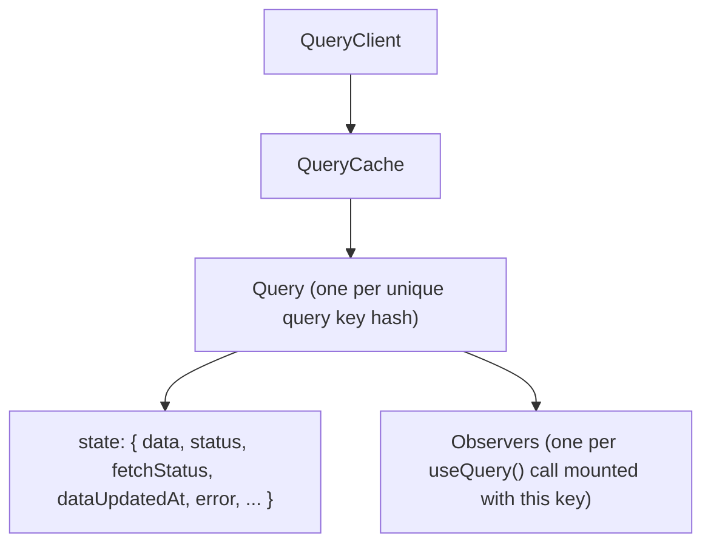

# 01 · Mental Model

Before any API, get the model right. Most React Query bugs are model bugs — treating it like `useState`, or like a global store, instead of what it is.

## React Query is a cache, not a store

A **store** (Redux, Zustand) holds *your* state — the source of truth lives in the browser. A **cache** holds a *copy* of state whose source of truth lives somewhere else (the server) and can change without you. React Query is the second thing.

This single distinction explains every default:

- Data can be **stale** — because the real value lives on the server and may have moved on.
- Data is **refetched in the background** — to reconcile the copy with the source.
- Data is **garbage-collected** — because it's just a cache; you can always re-fetch.
- Writes go through **mutations + invalidation** — you tell the cache "this copy is probably wrong now," not "set this value."

If you ever find yourself manually syncing query data into Redux/Zustand, stop: you've created two caches of the same thing and they will disagree.

## The pieces



- **`QueryClient`** — the entry point. Holds the cache and the default options. Created once, provided via `QueryClientProvider`.
- **`QueryCache`** — the map of all queries, keyed by the **hashed** query key.
- **`Query`** — one logical piece of server state (e.g. "orders, page 2, filtered by status=open"). It owns the data, the status, timestamps, and the retry/refetch machinery.
- **`Observer`** — created by each `useQuery()` call. Many components can observe the same `Query`; they all read the same cached data and share one network request. When the last observer unmounts, the GC timer for that query starts.

```tsx
// Both components observe the SAME Query. One fetch, shared data.
function OrderCount()  { const { data } = useQuery({ queryKey: ["orders", p], queryFn }); ... }
function OrderTable()  { const { data } = useQuery({ queryKey: ["orders", p], queryFn }); ... }
```

## Two independent status axes

A v5 query reports **two** statuses, and conflating them is the most common confusion:

| | Values | Answers |
| --- | --- | --- |
| **`status`** | `pending` / `error` / `success` | *Do I have data?* (cache content) |
| **`fetchStatus`** | `fetching` / `paused` / `idle` | *Is a request in flight right now?* |

You can be `status: "success"` **and** `fetchStatus: "fetching"` at the same time — that's a background refetch of data you already have. The "is the spinner showing for the first load" question is `status === "pending"`; the "is anything loading at all" question is `isFetching`.

```tsx
const { data, status, fetchStatus, isLoading, isFetching } = useQuery({ ... });
// isLoading  === (status === "pending" && fetchStatus === "fetching")  → true first load only
// isFetching === (fetchStatus === "fetching")                          → any fetch, incl. background
```

> **v4 → v5 rename:** `status: "loading"` became `status: "pending"`, and `isLoading` is now derived (first load only) rather than a synonym for `isFetching`. `cacheTime` became `gcTime`.

## The lifecycle of one query, end to end

1. A component mounts and calls `useQuery({ queryKey, queryFn })`. An **Observer** is created.
2. No cached data for this key hash → `status: "pending"`, `queryFn` runs, `fetchStatus: "fetching"`.
3. `queryFn` resolves → data stored in the cache, `status: "success"`, `dataUpdatedAt` stamped, `fetchStatus: "idle"`.
4. Data is **fresh** for `staleTime`. While fresh, new observers mounting with the same key get the cached data with **no refetch**.
5. After `staleTime`, data is **stale**. It's still shown, but now any trigger (remount, window focus, reconnect, explicit invalidate) causes a background refetch.
6. The last observer unmounts → the query becomes **inactive**. After `gcTime`, if still inactive, it's removed from the cache.

The full freshness/GC details are in [03-caching-lifecycle.md](./03-caching-lifecycle.md).

## Why query keys are everything

The cache is a map keyed on the **hash** of the query key. So the key is simultaneously:

- the **cache identity** (same key → same data, deduped),
- the **dependency array** (key changes → React Query treats it as a different query and fetches),
- the **invalidation handle** (you invalidate by key prefix).

Getting keys right is 80% of using React Query well — that's the entire next page: [02-query-keys.md](./02-query-keys.md).

## What React Query does *not* do

- It is **not** a client-state manager. Filters-in-progress, modal open/closed, selected rows → keep in `useState`/Zustand. (See [../state-management-performance/05-zustand.md](../state-management-performance/05-zustand.md).)
- It does **not** normalize entities like RTK Query or Apollo. Each query caches its own response shape. If you need cross-query entity dedup, you wire it yourself with `setQueryData` (see [06-invalidation.md](./06-invalidation.md)).
- It does **not** fetch — *you* provide the `queryFn`. React Query owns the *when* and the *cache*, never the *how*.

Continue to [02-query-keys.md](./02-query-keys.md).
