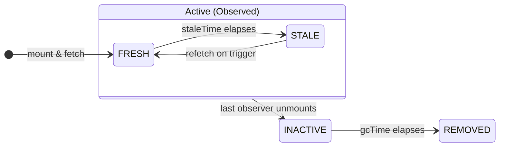

# 03 · Caching Lifecycle

The two timers — `staleTime` and `gcTime` — control almost all of React Query's behavior. They answer different questions and people constantly confuse them.

## `staleTime` vs `gcTime` — the core distinction

| | `staleTime` | `gcTime` (was `cacheTime`) |
| --- | --- | --- |
| Question | *How long is cached data trusted as fresh?* | *How long is unused data kept before deletion?* |
| Default | `0` (immediately stale) | `5 * 60_000` (5 min) |
| Applies while | The query is **active** (observed) | The query is **inactive** (no observers) |
| Effect | Controls **refetching** | Controls **memory / cache eviction** |

They operate at different stages of life:



- **`staleTime: 0`** (default) means data is stale the instant it arrives, so React Query refetches on every remount/focus/reconnect. This is *safe* (always fresh) but *chatty*. For large lists it causes refetch storms — raise it.
- **`gcTime`** only starts counting once **no component observes the query**. A mounted query is never garbage-collected, regardless of `gcTime`.

> A common mistake: setting `gcTime: 0` to "force fresh data." That doesn't force freshness (`staleTime` does) — it just destroys the cache the moment a component unmounts, killing the back-button / tab-switch experience.

## Choosing `staleTime` per data type

Set it by **how fast the data actually changes**, not globally. Tune at the query level via `queryOptions`:

```tsx
staleTime: 0            // live data: prices, presence, anything that must be current
staleTime: 30_000       // typical lists: 30s smooths pagination & focus refetches
staleTime: 5 * 60_000   // slow data: catalog, config
staleTime: Infinity      // immutable: a closed invoice, a historical record — never auto-refetch
```

A sensible global default plus per-query overrides:

```tsx
const queryClient = new QueryClient({
  defaultOptions: {
    queries: {
      staleTime: 30_000,
      gcTime: 5 * 60_000,
      refetchOnWindowFocus: false, // usually too aggressive for big tables
      retry: 2,
      retryDelay: (attempt) => Math.min(1000 * 2 ** attempt, 30_000), // exp backoff
    },
  },
});
```

## What triggers a refetch

A **stale** query refetches automatically on any of these (each has an opt-out flag):

| Trigger | Flag | Default |
| --- | --- | --- |
| A new observer mounts | `refetchOnMount` | `true` |
| Window/tab regains focus | `refetchOnWindowFocus` | `true` |
| Network reconnects | `refetchOnReconnect` | `true` |
| `staleTime` countdown isn't a trigger by itself | — | — |
| Interval polling | `refetchInterval: ms` | off |

Key nuance: **fresh data never refetches on these triggers.** The flags only matter once data is stale. So `staleTime` is your primary refetch-volume lever; the `refetchOn*` flags are secondary. `refetchInterval` is the exception — it polls regardless of staleness.

```tsx
useQuery({
  ...orderQueries.list(params),
  refetchInterval: 10_000,            // poll every 10s
  refetchIntervalInBackground: false, // ...but pause when the tab is hidden
});
```

Manual triggers: `invalidateQueries` (marks stale **and** refetches active queries — see [06-invalidation.md](./06-invalidation.md)), `refetch()` from the hook result, and `qc.refetchQueries(...)`.

## Fetch states, precisely

```tsx
const q = useQuery(orderQueries.list(params));
```

- `q.isPending` — no data yet (`status === "pending"`). First-ever load for this key.
- `q.isLoading` — `isPending && isFetching`. First load *with a request in flight*. Use this for the initial spinner.
- `q.isFetching` — a request is in flight, **including background refetches** of data you already show. Use for a subtle "refreshing" indicator.
- `q.isStale` — data exists but is past `staleTime`.
- `q.isError` / `q.error` — the `queryFn` threw (after retries exhausted).
- `q.isPlaceholderData` — the shown data is placeholder/previous, not the real result yet (see [04-pagination-infinite.md](./04-pagination-infinite.md)).

```tsx
if (q.isPending) return <Skeleton />;          // nothing to show yet
if (q.isError)   return <Error err={q.error} />;
return (
  <>
    {q.isFetching && <RefreshingBadge />}        {/* background refresh, data still visible */}
    <Table rows={q.data.data} />
  </>
);
```

## Structural sharing — free render savings

After every fetch, React Query **structurally shares** the new result with the old one: unchanged parts of the object tree keep their previous references. So if a refetch returns the same 50 rows with one field changed on one row, only that one row object gets a new reference — memoized rows for the other 49 don't re-render.

- It's **on by default** and you almost always want it.
- It requires JSON-compatible data (it walks plain objects/arrays).
- For very large responses where the structural diff itself is costly, you can disable it (`structuralSharing: false`) or supply a custom comparator.

This is why a memoized row component plus stable keys is so effective with React Query — covered in [10-performance.md](./10-performance.md).

## `initialData` vs `placeholderData`

Both pre-fill a query, but they mean different things:

| | `initialData` | `placeholderData` |
| --- | --- | --- |
| Treated as | **Real, cached** data | A **temporary stand-in** |
| Affects `dataUpdatedAt`/staleness | Yes — counts as a real fetch result | No — query still considered to have never fetched |
| `isPlaceholderData` | `false` | `true` |
| Use when | You genuinely have the server data already (e.g. from a list, seeding a detail) | You want *something* on screen while the real fetch runs |

```tsx
// Seed a detail query from a row already in the list cache — it IS the server data:
useQuery({
  ...orderQueries.detail(id),
  initialData: () => qc.getQueryData(orderKeys.lists())?.find?.((o) => o.id === id),
  initialDataUpdatedAt: () => qc.getQueryState(orderKeys.lists())?.dataUpdatedAt,
});

// Show the previous page while the next loads — it's a stand-in, not truth:
useQuery({ ...orderQueries.list(params), placeholderData: keepPreviousData });
```

Continue to [04-pagination-infinite.md](./04-pagination-infinite.md).
