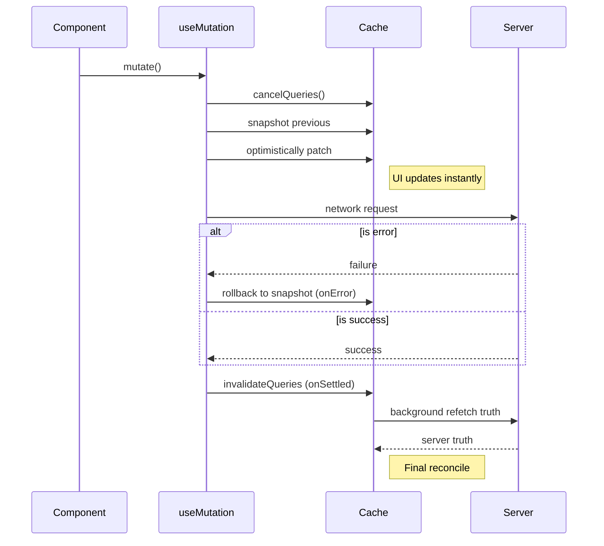

# 05 · Mutations & Optimistic Updates

Queries read; **mutations** write. A mutation doesn't touch the cache by itself — after it succeeds you tell the cache what changed, either by **invalidating** (re-fetch the truth) or by **writing the result in** (`setQueryData`).

## Anatomy of a mutation

```tsx
import { useMutation, useQueryClient } from "@tanstack/react-query";

function useUpdateOrder() {
  const qc = useQueryClient();
  return useMutation({
    mutationFn: (input: { id: string; patch: Partial<Order> }) =>
      updateResource("orders", input.id, input.patch),   // returns the updated Order
    onSuccess: (updated, input) => {
      qc.invalidateQueries({ queryKey: orderKeys.lists() });   // list pages may now be wrong
      qc.setQueryData(orderKeys.detail(input.id), updated);    // we have the truth — write it
    },
  });
}
```

Call it:

```tsx
const update = useUpdateOrder();
update.mutate({ id, patch: { status: "shipped" } });
// or, to await: await update.mutateAsync({ id, patch });

update.isPending  // request in flight
update.isError    // failed
update.isSuccess  // done
```

> Use `mutate` for fire-and-forget (errors surface via `onError`/`isError`). Use `mutateAsync` only when you need to `await` and handle the rejection yourself — **and then you must `catch`**, or an unhandled rejection escapes.

## The mutation lifecycle callbacks

They fire in this order, and each exists for a reason:

```tsx
useMutation({
  mutationFn,
  onMutate:  (vars) => { /* BEFORE the request — set up optimistic update, return rollback ctx */ },
  onError:   (err, vars, ctx) => { /* request failed — roll back using ctx */ },
  onSuccess: (data, vars, ctx) => { /* request succeeded — write/invalidate */ },
  onSettled: (data, err, vars, ctx) => { /* ALWAYS, after success or error — final reconcile */ },
});
```

- **`onMutate`** runs synchronously before the request. Its return value becomes `ctx` in the later callbacks — that's how you pass the rollback snapshot.
- **`onSettled`** runs regardless of outcome. The standard place for a final `invalidateQueries`, so the cache reconciles with the server no matter what.

There are also per-call callbacks on `mutate(vars, { onSuccess, onSettled })` — useful for UI concerns (close a modal, toast) that don't belong in the shared hook. The hook-level callbacks run **before** the per-call ones.

## Invalidate vs. write — which after a mutation?

| | `invalidateQueries` | `setQueryData` |
| --- | --- | --- |
| What it does | Marks queries stale + refetches active ones | Writes a value directly into the cache |
| Network cost | One (or more) refetches | None |
| Correctness | Always ends up matching the server | Only as correct as the value you write |
| Use when | The write may affect many queries in ways you can't compute (list ordering, aggregates, server-computed fields) | The server hands you the exact new entity, or you can compute the change precisely |

**Default to `invalidateQueries`.** It's the safe choice — the server is the source of truth and you let it stay that way. Reach for `setQueryData` when you have the authoritative new value and want to skip a round-trip (e.g. the update endpoint returns the full updated record), or for optimistic updates below.

A common, pragmatic combo: write the detail you know exactly, invalidate the lists you can't compute.

```tsx
onSuccess: (updated, { id }) => {
  qc.setQueryData(orderKeys.detail(id), updated);  // exact truth, no refetch
  qc.invalidateQueries({ queryKey: orderKeys.lists() }); // ordering/filtering may have changed
},
```

## Optimistic updates — the canonical pattern

Apply the change to the cache *before* the server confirms, for instant UI. The discipline is: **cancel → snapshot → patch → rollback on error → reconcile on settle.**



```tsx
function useToggleOrderStatus() {
  const qc = useQueryClient();
  return useMutation({
    mutationFn: ({ id, status }: { id: string; status: OrderStatus }) =>
      updateResource("orders", id, { status }),

    onMutate: async ({ id, status }) => {
      // 1. Cancel in-flight refetches so they can't overwrite our optimistic value
      await qc.cancelQueries({ queryKey: orderKeys.detail(id) });
      // 2. Snapshot the current value for rollback
      const previous = qc.getQueryData<Order>(orderKeys.detail(id));
      // 3. Optimistically patch the cache
      qc.setQueryData<Order>(orderKeys.detail(id), (o) => o && { ...o, status });
      // 4. Pass the snapshot to onError via ctx
      return { previous };
    },

    onError: (_err, { id }, ctx) => {
      // 5. Roll back to the snapshot
      if (ctx?.previous) qc.setQueryData(orderKeys.detail(id), ctx.previous);
    },

    onSettled: (_data, _err, { id }) => {
      // 6. Reconcile with the server regardless of outcome
      qc.invalidateQueries({ queryKey: orderKeys.detail(id) });
    },
  });
}
```

Every step matters:

1. **`cancelQueries`** — without it, a background refetch that started before your mutation can land *after* it and clobber the optimistic value.
2. **Snapshot** — you can't roll back what you didn't save.
3. **Patch** — the optimistic write; use the functional updater so you patch the *current* value.
4. **Return ctx** — the channel to `onError`.
5. **Rollback** — restore on failure.
6. **Reconcile** — `onSettled` invalidate guarantees eventual consistency even if your optimistic value was slightly off.

### Optimistically updating a list

When the mutation affects a list (e.g. toggling status changes what's shown), patch matching list entries. `setQueriesData` (plural) patches *all* queries matching a filter at once:

```tsx
onMutate: async ({ id, status }) => {
  await qc.cancelQueries({ queryKey: orderKeys.lists() });
  const snapshots = qc.getQueriesData<ListResponse>({ queryKey: orderKeys.lists() });
  qc.setQueriesData<ListResponse>({ queryKey: orderKeys.lists() }, (old) =>
    old && { ...old, data: old.data.map((o) => (o.id === id ? { ...o, status } : o)) },
  );
  return { snapshots };
},
onError: (_e, _v, ctx) =>
  ctx?.snapshots?.forEach(([key, data]) => qc.setQueryData(key, data)),
```

## Mutation hygiene for large data

- **Don't optimistically update everything.** Optimistic UI shines for cheap, high-frequency, low-risk toggles (status, favorite, reorder). For complex writes that change server-computed fields, plain invalidate-on-success is simpler and less bug-prone.
- **Scope invalidations.** `invalidateQueries({ queryKey: orderKeys.lists() })` not `invalidateQueries()` (which nukes the entire cache and refetches every active query — a self-inflicted refetch storm).
- **`onSettled` is your safety net.** Even with optimistic writes, the final invalidate means a wrong guess self-corrects within one refetch.
- **Serialize dependent mutations** with `mutationKey` + scopes if order matters; by default mutations run in parallel.

Continue to [06-invalidation.md](./06-invalidation.md).
